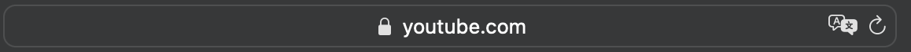

1. Определите, на каком протоколе работает сайт youtube.com.
Сделайте скриншот с названием 1_protocol.jpg, по которому станет понятно, как вы определили протокол сайта.

- протокол https

2. Создайте файл 2_analyze.txt, в котором проанализируйте структуру страницы сайта https://ru.wikipedia.org/, а именно нужно описать (коротко, своими словами), какие блоки есть на сайте, что в этих блоках находится. Есть ли на сайте шапка, подвал, что в них содержится? Как и где расположен контент? Есть ли дополнительные элементы на странице?

[task2](2_analyze.txt)
- header - содержит кнопки регистрации и авторизации, поле для поиска, приветственное сообщение `Добро пожаловать в Википедию`, элементы навигации, счетчик статей, кнопка `создать статью`

- sidebar - в левой части расположены логотип и ниже блоки ссылок. Содержит навигацию по сайту, гиперссылки по темам участие, инструменты, печать/экспорт, другие проекты, выбор языка

- content - содержит карточки с наполнением из статей, картинок, гиперрссылок на статьи внутри сайта

- footer - содержит ссылки и лого на проекты Вики. Ниже расположена правовая и контактная информация.

3. Внесите не менее 10 изменений на страницу любой статьи сайта https://ru.wikipedia.org/, с помощью инструмента разработчика и представьте два скриншота было/стало (скриншоты должны иметь названия 3_before.jpg, 3_after.jpg соответственно). Желательно поработать с изменением текста на странице, заменой картинки, изменением стилей.

### before

### after

4. Создайте прототип низкой детализации сайта https://dzen.ru/ с помощью сайта https://wireframe.cc/. Предоставьте скриншот того, что получилось (скриншот должен быть назван 4_proto.jpg).

